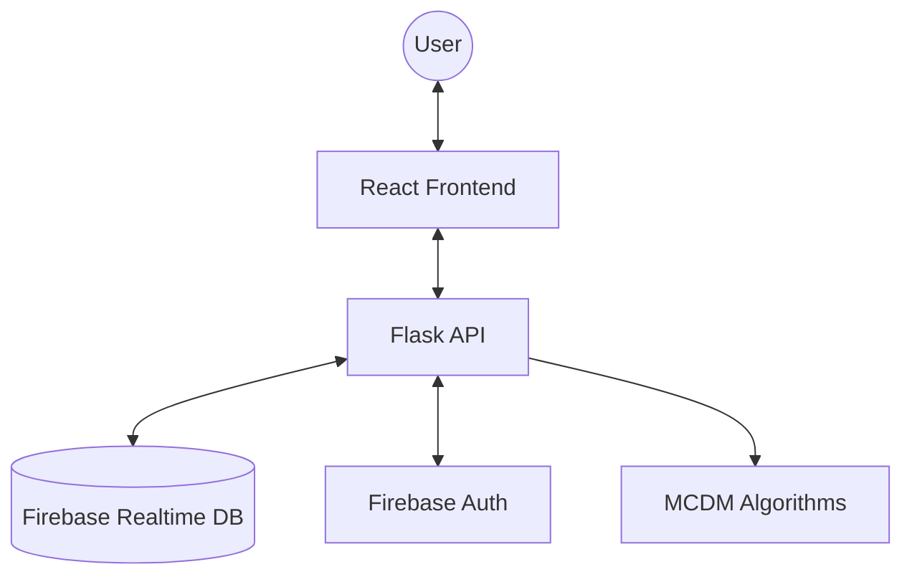

# 🌐 Dynamic Cloud Service Composition System - Technical Documentation

## 1. Project Overview
The **Dynamic Cloud Service Composition System** is an intelligent platform designed to help users select and rank cloud services (e.g., Storage, Compute, Database) based on multiple Quality of Service (QoS) criteria. It leverages advanced Multi-Criteria Decision Making (MCDM) algorithms to provide objective, data-driven recommendations.

### Key Features
- **Real-time Ranking**: Uses Entropy Weight + TOPSIS algorithms to rank services.
- **Dynamic QoS**: Supports Response Time, Throughput, Security, and Cost as primary criteria.
- **Bulk Operations**: Supports manual entry and bulk upload via Excel (.xlsx).
- **Secure Auth**: Integrated with Firebase Authentication for user-specific data isolation.
- **Serverless Ready**: Optimized for deployment on platforms like Vercel.

---

## 2. System Architecture
The application is structured as a **Monorepo**, separating concerns between a Flask-based backend and a React-based frontend.

### Component Interaction
1. **Frontend**: React (Vite) handles the user interface, state management (Auth Context), and API calls via Axios.
2. **Backend**: Flask provides a standardized REST API (`/api/auth`, `/api/services`).
3. **Database**: Firebase Realtime Database stores user profiles and service records.
4. **Auth**: Firebase Admin SDK and Pyrebase manage user sessions and tokens.

---

## 3. Backend Implementation Details

### API Endpoints
All endpoints are prefixed with `/api`.

#### Authentication (`/api/auth`)
- **POST `/register`**: Creates a new user in Firebase and initializes their profile in the DB.
- **POST `/login`**: Authenticates user and returns an ID Token + Refresh Token.
- **GET `/profile`**: Retrieves private user data using the bearer token.

#### Services (`/api/services`)
- **GET `/`**: Lists all services for the authenticated user.
- **POST `/manual`**: Adds a single service record.
- **POST `/upload`**: Processes Excel files to add multiple services at once.
- **POST `/rank`**: Trigger the MCDM pipeline on the user's stored services.
- **PUT / DELETE**: Standard CRUD operations for specific service records.

### Database Schema
Data is stored hierarchically in Firebase Realtime Database:
- `/users/{uid}`: Profile information.
- `/services/{uid}/{push_id}`: Service records, including QoS parameters:
    - `service_name`: (String)
    - `response_time`: (Float, lower is better)
    - `throughput`: (Float, higher is better)
    - `security`: (Float 0-100, higher is better)
    - `cost`: (Float, lower is better)

---

## 4. MCDM Algorithms
The core "intelligence" of the system resides in the hybrid algorithm pipeline.

### Part A: Entropy Weight Method (EWM)
Used to calculate the **objective weight** of each QoS criterion based on the variance of the data. 

**Mathematical Steps:**
1. **Normalization**: Scale data to [0, 1] range.
2. **Probability Matrix**: Convert normalized values into a probability distribution column-wise.
3. **Entropy Calculation**: $E_j = -k \sum p_{ij} \ln(p_{ij})$, where $k = 1/\ln(m)$.
4. **Divergence**: Calculate degree of variation $d_j = 1 - E_j$.
5. **Weights**: Final weights $w_j = d_j / \sum d_j$.

### Part B: TOPSIS (Technique for Order of Preference by Similarity to Ideal Solution)
Ranks services based on their geometric distance to the best and worst possible solutions.

**Mathematical Steps:**
1. **Vector Normalization**: $r_{ij} = x_{ij} / \sqrt{\sum x_{ij}^2}$.
2. **Weighted Normalized Matrix**: $v_{ij} = w_j \cdot r_{ij}$.
3. **Ideal Solutions**:
    - Positive Ideal ($V^+$): Best values for each criterion.
    - Negative Ideal ($V^-$): Worst values for each criterion.
4. **Separation Distances**:
    - $D_i^+$: Euclidean distance to $V^+$.
    - $D_i^-$: Euclidean distance to $V^-$.
5. **Closeness Coefficient (CC)**: $C_i = D_i^- / (D_i^+ + D_i^-)$.
6. **Ranking**: Services are sorted by $C_i$ descending (closer to 1 is better).

---

## 5. Frontend & UI
Built with React, Vite, and Tailwind CSS.

### Key Components
- **AuthProvider**: Wraps the app to provide `currentUser`, [token](file:///d:/Major%20Project/MCDM/backend/database.py#99-103), and [logout()](file:///d:/Major%20Project/MCDM/frontend/src/App.jsx#46-51) globally via React Context.
- **ProtectedRoute**: Gated routes that redirect unauthenticated users to `/login`.
- **Dashboard**: The main workspace for viewing, adding, and ranking services.
- **Charts/Tables**: Visual representation of QoS data and ranking results.

---

## 6. Deployment & Configuration
The project is configured for seamless deployment on **Vercel**.

### Environment Variables
The following must be set in [.env](file:///d:/Major%20Project/MCDM/.env) (local) or Vercel dashboard:
- `FIREBASE_API_KEY`
- `FIREBASE_DATABASE_URL`
- `FIREBASE_PROJECT_ID`
- `FIREBASE_SERVICE_ACCOUNT_JSON`: Full JSON string of the service account for backend Admin SDK.

### Vercel Configuration ([vercel.json](file:///d:/Major%20Project/MCDM/vercel.json))
- Routes all `/api/(.*)` requests to [backend/app.py](file:///d:/Major%20Project/MCDM/backend/app.py).
- Serves the frontend production build from `frontend/dist`.
- Handles client-side routing by redirecting all other requests to `index.html`.
