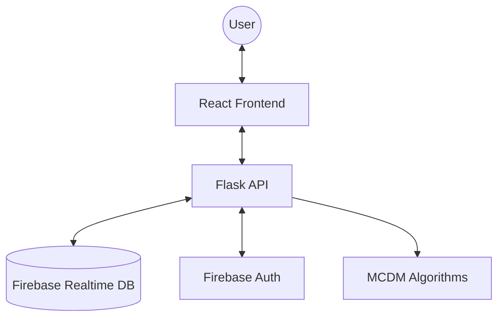

# 🌐 Dynamic Cloud Service Composition System - Technical Documentation

## 1. Project Overview
The **Dynamic Cloud Service Composition System** is an intelligent platform designed to help users select and rank cloud services (e.g., Storage, Compute, Database) based on multiple Quality of Service (QoS) criteria. It leverages advanced Multi-Criteria Decision Making (MCDM) algorithms (Entropy Weight + TOPSIS) to provide objective, data-driven recommendations.

### Key Features
- **Real-time Ranking**: Uses Entropy Weight + TOPSIS algorithms to rank services.
- **Dynamic QoS**: Supports Response Time, Throughput, Security, and Cost as primary criteria.
- **Bulk Operations**: Supports manual entry and bulk upload via Excel (.xlsx).
- **AI-powered Cloud Assistant**: Integrated Gemini-powered chatbot (`gemma-3-1b-it`) to assist with MCDM concepts and app navigation.
- **Secure Auth**: Integrated with Firebase Authentication for user-specific data isolation.
- **Modern UI**: Responsive dashboard built with React and Tailwind CSS.
- **Serverless Ready**: Optimized for deployment on platforms like Vercel.

---

## 2. System Architecture
The application is structured as a **Monorepo**, separating concerns between a Flask-based backend and a React-based frontend.

### Component Interaction
1. **Frontend**: React (Vite) handles the user interface, state management (Auth Context), and API calls via Axios.
2. **Backend**: Flask provides a standardized REST API (`/api/auth`, `/api/services`, `/api/chatbot`).
3. **Database**: Firebase Realtime Database stores user profiles and service records.
4. **Auth**: Firebase Admin SDK and Pyrebase manage user sessions and tokens.

---

## 3. Backend Implementation Details

### API Endpoints
All endpoints are prefixed with `/api`.

#### Authentication (`/api/auth`)
- **POST `/register`**: Creates a new user in Firebase and initializes their profile.
- **POST `/login`**: Authenticates user and returns an ID Token + Refresh Token.
- **GET `/profile`**: Retrieves private user data using the bearer token.

#### Services & AI (`/api/services` & `/api/chatbot`)
- **GET `/api/services`**: Lists all services with search, sort, and pagination.
- **POST `/api/services/manual`**: Adds a single service record.
- **POST `/api/services/upload`**: Processes Excel files for bulk service addition.
- **POST `/api/services/rank`**: Triggers the MCDM pipeline (Entropy weight + TOPSIS).
- **PUT `/api/services/<id>`**: Updates an existing service record.
- **DELETE `/api/services/<id>`**: Deletes a specific service record.
- **DELETE `/api/services`**: Deletes all services for the authenticated user.
- **POST `/api/chatbot/chatbot`**: Interface for the AI Cloud Assistant (Gemini).

### Core Modules
- **`app.py`**: The main entry point that initializes the Flask app and registers blueprints.
- **`services.py`**: Handles CRUD operations for service records and Excel parsing.
- **`chatbot.py`**: Integrates the Gemini API with a system prompt tailored for MCDM.
- **`algorithm.py`**: Contains the mathematical logic for Entropy Weight Method and TOPSIS.
- **`auth.py`**: Manages Firebase user registration and login.
- **`database.py`**: Provides low-level interaction with Firebase Realtime Database.

---

## 4. MCDM Algorithms
The system uses a hybrid approach to provide objective rankings.

### Part A: Entropy Weight Method (EWM)
Used to calculate the **objective weight** of each QoS criterion (Response Time, Throughput, Security, Cost) based on the variance within the dataset. It ensures that criteria with higher information value (more variance) have a greater impact on the final score.

### Part B: TOPSIS
Ranks services based on their geometric distance to the **Positive Ideal Solution** (best possible values) and the **Negative Ideal Solution** (worst possible values). A Closeness Coefficient (CC) is calculated for each service, where a value closer to 1 indicates a better service.

---

## 5. Frontend & UI
Built with React, Vite, and Tailwind CSS.

### Key Components & Pages
- **`App.jsx`**: Main router and provider configuration.
- **`AuthProvider`**: Manages user authentication state and tokens via React Context.
- **`Dashboard.jsx`**: The primary user interface for managing services and viewing rankings.
- **`Login.jsx` / `Register.jsx`**: Authentication pages.
- **`Chatbot.jsx`**: A floating AI assistant for real-time help.
- **`index.css`**: Global styles and Tailwind imports.

---

## 6. Deployment & Configuration
The project is configured for **Vercel** with a monorepo setup.

### Environment Variables (.env)
- `FIREBASE_API_KEY`
- `FIREBASE_DATABASE_URL`
- `FIREBASE_PROJECT_ID`
- `FIREBASE_SERVICE_ACCOUNT_JSON`: Service account JSON for backend Admin SDK.
- `GEMINI_API_KEY`: API key for Google Gemini AI.

---

## 7. Unwanted / Redundant Files
The following files are identified as temporary, redundant, or sensitive files that should not be tracked or are no longer needed:

- **`chatbot_errors.log`**: Temporary log file generated by the chatbot for debugging.
- **`test_ai_search.py`**: Redundant testing script in the root directory.
- **`backend/debug_gemini.py`**: Internal debugging script for Gemini connectivity.
- **`backend/list_models.py`**: Utility script used during development to list AI models.
- **`backend/test_rest.py`**: Rest API testing script.
- **`frontend/.env.local`**: Local environment overrides that should remain private.
- **`firebase_credentials.json`**: Sensitive service account credentials (already in `.gitignore`).
